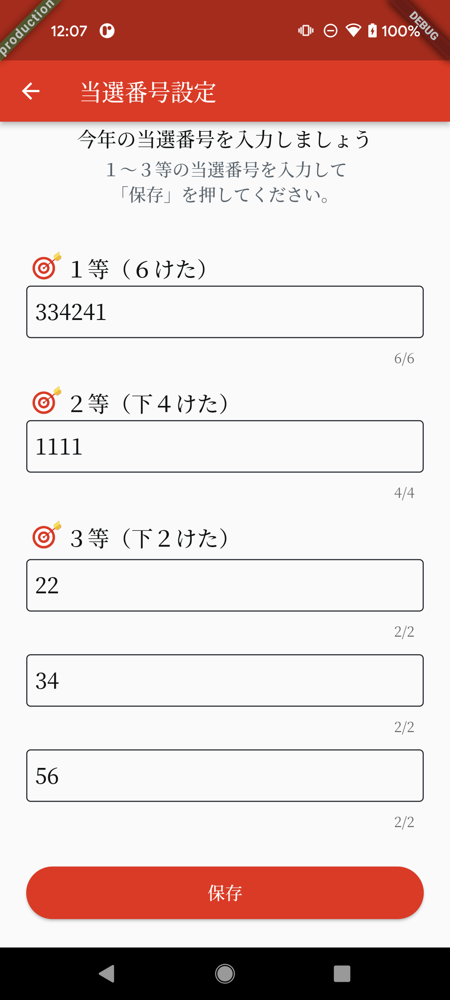

# 年賀玉（nengar）

年賀状のお年玉番号を認識するアプリ

# 開発環境

# ライブラリ

| 名前 | 用途 |
|-----|-----|
| [camera](https://pub.dev/packages/camera) | カメラ |
| [cupertino_icons](https://pub.dev/packages/cupertino_icons) | アイコンアセット |
| [flutter_hooks](https://pub.dev/packages/flutter_hooks) | ウィジェットライフサイクル管理 |
| [flutter_platform_widgets](https://pub.dev/packages/flutter_platform_widgets) | PF別ウィジェット |
| [flutter_use](https://pub.dev/packages/flutter_use) | flutter_hooks拡張 |
| [json_annotation](https://pub.dev/packages/json_annotation) | コード生成用のアノテーション |
| [go_router](https://pub.dev/packages/go_router) | 画面遷移 |
| [google_mlkit_text_recognition](https://pub.dev/packages/google_mlkit_text_recognition) | 文字認識 |
| [intl](https://pub.dev/packages/intl) | ローカライズ |
| [logger](https://pub.dev/packages/logger) | ログ |
| [shared_preferences](https://pub.dev/packages/shared_preferences) | 永続化 |
| [build_runner](https://pub.dev/packages/build_runner) | ファイル生成 |
| [flutter_gen_runner](https://pub.dev/packages/flutter_gen_runner) | リソース用のコード生成 |
| [flutter_launcher_icons](https://pub.dev/packages/flutter_launcher_icons) | ランチャーアイコン用のコマンドラインツール |
| [flutter_lints](https://pub.dev/packages/flutter_lints) | リント |
| [json_serializable](https://pub.dev/packages/json_serializable) | json_annotationからのコード生成 |

# Flavor

| 名前 | 用途 |
|---|---|
| development | 開発用 |
| production | 製品用 |

# ビルド

## Android

# スクリーンショット

   