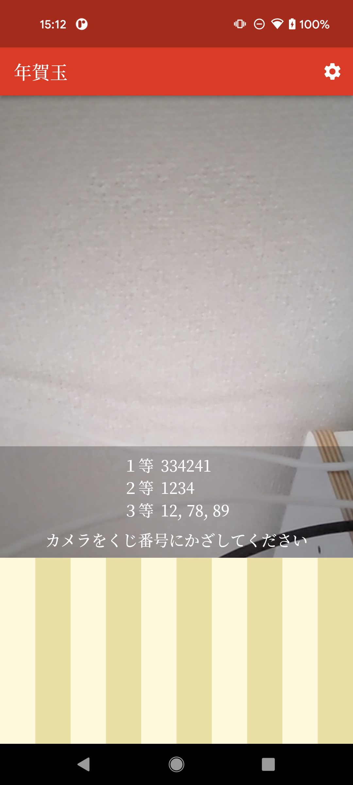

# 年賀玉（nengar）

年賀状のお年玉番号を認識するアプリ

[](https://play.google.com/store/apps/details?id=com.tatsuki.nengar)

# 開発環境
Flutter のバージョン管理に [fvm](https://github.com/fluttertools/fvm) を使用しています。

[](https://developer.apple.com/jp/xcode/)

# ライブラリ

| 名前 | 用途 |
|-----|-----|
| [camera](https://pub.dev/packages/camera) | カメラ |
| [cupertino_icons](https://pub.dev/packages/cupertino_icons) | アイコンアセット |
| [flutter_hooks](https://pub.dev/packages/flutter_hooks) | ウィジェットライフサイクル管理 |
| [flutter_platform_widgets](https://pub.dev/packages/flutter_platform_widgets) | PF別ウィジェット |
| [flutter_use](https://pub.dev/packages/flutter_use) | flutter_hooks拡張 |
| [json_annotation](https://pub.dev/packages/json_annotation) | コード生成用のアノテーション |
| [go_router](https://pub.dev/packages/go_router) | 画面遷移 |
| [google_mlkit_text_recognition](https://pub.dev/packages/google_mlkit_text_recognition) | 文字認識 |
| [intl](https://pub.dev/packages/intl) | ローカライズ |
| [logger](https://pub.dev/packages/logger) | ログ |
| [shared_preferences](https://pub.dev/packages/shared_preferences) | 永続化 |
| [build_runner](https://pub.dev/packages/build_runner) | ファイル生成 |
| [flutter_gen_runner](https://pub.dev/packages/flutter_gen_runner) | リソース用のコード生成 |
| [flutter_launcher_icons](https://pub.dev/packages/flutter_launcher_icons) | ランチャーアイコン用のコマンドラインツール |
| [flutter_lints](https://pub.dev/packages/flutter_lints) | リント |
| [json_serializable](https://pub.dev/packages/json_serializable) | json_annotationからのコード生成 |

# Flavor

| 名前 | 用途 |
|---|---|
| development | 開発用 |
| production | 製品用 |

## デザインラフ（FlutterFlow）

https://app.flutterflow.io/project/nengar-ov1hq5

## 文言管理

flutter_localizations を使用して文言を管理しています。 lib/l10n/app_ja.arb が実際に使用する文言を管理しているファイルです。
文言を追加する場合はこちらのファイルに追記して以下コマンドを実行します。実行すると .dart_tool/flutter_gen/gen_l10n/app_localizations_ja.dart
が 生成or編集されます。

```
fvm flutter gen-l10n
```

## リソース管理

flutter_gen を使用してアセットやカラー、フォントなどリソースを管理しています。リソースを管理しているファイルは lib/gen に出力されるよう pubspec.yaml
に設定しています。 リソース類は assets フォルダにまとめています。新たに追加した場合は以下コマンドを実行します。

```
fvm flutter packages pub run build_runner build
```

## iOS

### 前準備

CocoaPods をグローバルにインストールしないため、以下コマンドで fvm 経由の flutter コマンド実行時にローカルインストールされた CocoaPods を使用するように
以下コマンドを実行する。

```
cd ios
export PATH="$PWD/vendor/bin:$PATH"
hash -r 2>/dev/null || true 
```

以下コマンドにて疎通確認する

```
fvm flutter doctor
```

### ビルド

```
fvm flutter run --debug --target='lib/main.dart' --dart-define=FLAVOR=development
```

＊FLAVOR指定すると BundleID が dev 版の方が使われ、ProvisioningProfile を用意していないためビルドエラーになる そのため、--dart-define
を指定せず実行する（要更新）

## Android

# スクリーンショット

    